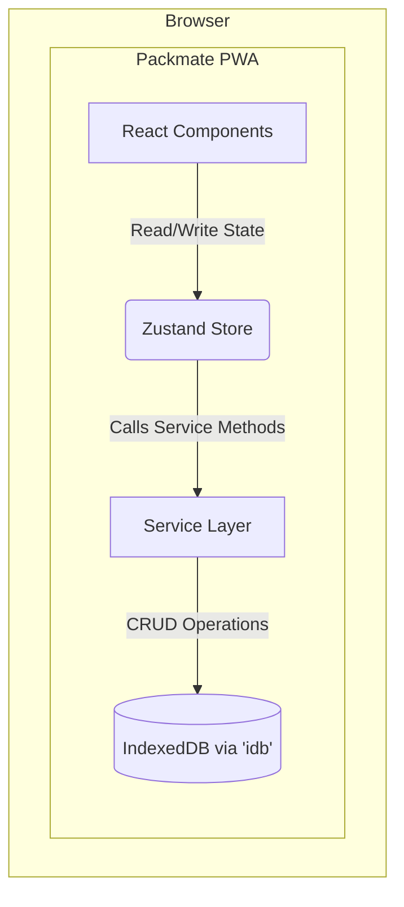

# Packmate PWA

**Your smart packing assistant. Catalog your belongings, create virtual bags for trips, and never forget an item again.**

---

## 🔍 Overview

Packmate is an offline-first Progressive Web App (PWA) designed to eliminate the stress of packing for travel. It allows you to create a digital catalog of your belongings, plan your trips with detailed packing lists, and ensure you bring everything back home.

- **For meticulous travelers:** Built for anyone who loves to plan and wants to avoid the "Did I pack that?" anxiety.
- **Digital Inventory:** Catalog everything you own—clothes, electronics, toiletries—with images, categories, and tags.
- **Visual Trip Planning:** Add items from your catalog to virtual bags and create occasion-based outfits for your trips.
- **Offline-First & Private:** Works entirely offline. All data is stored locally in your browser via IndexedDB, ensuring your information remains private and accessible without an internet connection.
- **Installable:** As a PWA, Packmate can be installed on your mobile device or desktop for a native-app experience.

## 🧩 Problem, Solution & Impact

- **Problem Solved** → The recurring stress of packing: forgetting essential items, overpacking, and leaving things behind in a hotel room. The mental load of tracking what's packed and what's needed for different occasions is significant.
- **How It Solves It** → Packmate provides a systematic, digital-first approach. By creating a personal inventory, users can visually plan their packing lists. Features like bag assignment, outfit planning, and a dedicated "repacking" mode transform a chaotic process into a structured, stress-free activity.
- **Impact Created** → Users gain peace of mind, save time, and avoid the cost and inconvenience of replacing forgotten items. It promotes more intentional packing, potentially reducing overpacking and making travel smoother.

---

## 📑 Table of Contents

- [✨ Features](#-features)
- [🌱 Origin](#-origin)
- [⚡ Quick Start](#-quick-start)
- [🧭 Architecture](#-architecture)
- [🛣️ Future Roadmap](#️-future-roadmap--potential-features)
- [🔗 Comparable Projects](#-comparable-projects)
- [🧑‍🎓 Target Users & Use Cases](#-target-users--use-cases)
- [📂 Folder Structure](#-folder-structure)
- [🛠 Built With](#-built-with)
- [⚙️ Installation & Setup](#️-installation--setup)
- [🚀 Deployment](#-deployment)
- [💡 The Prompt That Started It All](#-the-prompt-that-started-it-all)
- [📜 License](#-license)

---

## ✨ Features

- ✅ **Smart Catalog:** Build a personal inventory of all your travel items with images, categories, and tags. Mark items as "essential" to prioritize them.
- ✅ **Trip Planning:** Create detailed trip folders with destinations, dates, and descriptions.
- ✅ **Packing Checklist:** A dynamic checklist to track what's packed and what's not, with progress bars for visual feedback.
- ✅ **Bag Management:** Create virtual bags (e.g., Carry-On, Suitcase) and assign items to specific bags to stay organized.
- ✅ **Outfit Planner:** Group items into outfits for specific occasions (e.g., "Beach Day," "Dinner Party") to ensure you have what you need for every event.
- ✅ **Repacking Mode:** A dedicated interface to ensure you repack everything before you leave your destination, preventing items from being left behind.
- ✅ **Import/Export:** Backup your trip data, including all items and plans, as a JSON file. Import trips to easily share or restore them.
- ✅ **Offline-First PWA:** Works entirely offline. All data is stored locally in the browser's IndexedDB. Installable on mobile and desktop for a native-app experience.

## 🌱 Origin

The idea for Packmate was born nearly a decade ago from a simple need: a better way to pack. I envisioned a digital catalog of everything I own, allowing me to "add" items to a virtual bag for a trip. This would help with packing before leaving, tracking items during the trip, and ensuring nothing was left behind when returning.

At the time, I lacked the full-stack development skills to bring it to life. However, with the evolution of modern web technologies like PWAs, client-side databases like IndexedDB, and powerful frameworks like Next.js, the concept is now fully achievable without complex backend infrastructure. This project is the realization of that long-held idea.

## ⚡ Quick Start

Get the project up and running on your local machine in minutes.

```bash
# 1. Clone the repository
git clone https://github.com/your-username/Packmate-PWA.git

# 2. Navigate to the project directory
cd Packmate-PWA

# 3. Install dependencies
npm install

# 4. Run the development server
npm run dev
```

Open [http://localhost:3000](http://localhost:3000) in your browser to see the result.

## 🧭 Architecture

Packmate is a client-side, offline-first Progressive Web App (PWA). It has no backend server; all data is stored and managed securely in the user's browser.

- **Framework:** [Next.js 14](https://nextjs.org/) with the App Router is used for the application structure, routing, and UI rendering.
- **Data Layer:** [IndexedDB](https://developer.mozilla.org/en-US/docs/Web/API/IndexedDB_API) serves as the local database. The [`idb`](https://github.com/jakearchibald/idb) library provides a promise-based, lightweight wrapper around the IndexedDB API. A service layer at `/lib/db/services` abstracts all database operations, providing a clean API for the rest of the application.
- **State Management:** Zustand is used for global client-side state management. It offers a minimal, hook-based API to manage state for trips, wardrobe items, and UI status without boilerplate.
- **PWA Functionality:** The `next-pwa` package generates a service worker to cache application assets, enabling full offline functionality and making the app installable on desktop and mobile devices.

### System Diagram



## 🛣️ Future Roadmap & Potential Features

- **AI-Powered Suggestions:**
  - Automatically analyze trip details to **suggest missing essentials**.
  - Provide **destination-aware recommendations** using weather and context (e.g., “Rainy in Amsterdam – don’t forget a raincoat”).
  - Auto-tagging of items using image recognition AI.
- **Cloud Sync & Collaboration:**
  - Secure login with cloud sync (Firebase/Supabase) for a seamless cross-device experience.
  - Share trip folders with friends or family for collaborative packing.
- **Advanced Templates:**
  - Offer pre-made packing templates for various trip types (e.g., "Ski Trip," "Business Conference").

## 🔗 Comparable Projects

While many wardrobe and packing apps exist, Packmate differentiates itself by being a comprehensive, offline-first PWA focused on the entire packing lifecycle.

| Project | Key Features | How Packmate Differs |
| :--- | :--- | :--- |
| Wardrobe catalog & photo uploads | Yes — Stylebook, Awear, Whering, GetWardrobe, Alta, Pureple, Save Your Wardrobe |
| Outfit planning/calendar | Yes — Most of the above apps include this |
| Packing list from outfits or item list | Yes — Stylebook, Whering, GetWardrobe, Awear, Pureple |
| Checklists for packing/unpacking | Yes — Some packing apps and features within wardrobe apps |
| Remote trip folder planning & sharing | Partially — Some support sharing lists, but coordinated trip folders mostly missing |
| Pack/unpack tracking across trip | Partial — Packing checklist exists, but few focus on return/unpacking workflows |
| Lightweight PWA, cross-device, offline | Rare or nonexistent; most are app-based |

### 🚀 How This Web App Differs

- Goes **beyond outfit planning** — manage your complete inventory (clothes, electronics, toiletries, documents, etc.).
- Upload and maintain your **personal catalog** with images.
- **Remote trip folder & template creation** for quick reuse.
- Track both **packing and re-packing** with intuitive checklists.
- Organize items into **custom categories** for clarity (Clothes, Electronics, Toiletries, Documents).
- Plan **outfits for specific occasions** within a trip (e.g., Cocktail Night, Beach Afternoon).
- Assign items to **specific bags** (Carry-On, Suitcase, Backpack) with a dedicated Bag View.
- **Collaborative** — share and co-pack with spouse, family, or travel buddies.
- Optimized for **offline use** as a Progressive Web App (PWA).

### 👤 User Scenarios

- **Before Trip**
    
    While commuting, open the app and start building your packing plan for the *Paris Trip – Aug 2025*.
    
    Add items to categories, assign outfits to upcoming events, and decide which bag each item will go in.
    
- **During Packing**
    
    Switch to checklist mode. Collapse categories (e.g., Toiletries, Electronics) and tick items off as you pack them into the right bag.
    
    The Bag View ensures nothing is misplaced.
    
- **At Hotel Return**
    
    Activate **Return Mode**. Check items back into their assigned bags to ensure nothing is left behind in the hotel room.
    
- **For Frequent Travelers**
    
    Reuse saved templates like *3-day Work Trip* or *Beach Vacation*. Templates include predefined categories, outfits, and bag structures, saving setup time for repeat trips.
    

### 💡Uses

- Enables **remote planning** — mentally pack your bags even when you’re not at home.
- Removes the **mental burden** of remembering every detail.
- Prevents **overpacking** by visualizing categories, outfits, and totals.
- Reduces the risk of leaving items behind with bag-level tracking.
- Centralizes your **wardrobe and travel essentials** in one easy-to-access app.
- Works not just for clothes, but **all travel items** — gadgets, documents, toiletries, and more.
| **Stylebook, Whering** | Digital wardrobe, outfit planning, packing lists. | Primarily native apps, often with a strong focus on fashion over general inventory. |
| **Packing Pro** | Detailed checklist generation. | Lacks the visual wardrobe catalog and integrated planning features. |
| **GetWardrobe** | AI-powered wardrobe and packing list generation. | Often requires a subscription for full features and is not offline-first. |

Packmate's unique value is its combination of a comprehensive inventory system, detailed packing features (bags, occasions, repacking), and its commitment to being a free, private, offline-first PWA.

## 🧑‍🎓 Target Users & Use Cases

- **The Organized Traveler:** Planners who enjoy preparing for trips and want a digital tool to perfect their process.
- **The Frequent Flyer:** Business travelers who can reuse templates for recurring trips, saving time and effort.
- **The Forgetful Packer:** Anyone who has ever left a phone charger or a favorite shirt in a hotel room.
- **The Family Vacation Planner:** A central place to organize packing for multiple people and complex trips.

### User Scenarios

- **Before a Trip:** While commuting, a user opens the app and starts building a packing plan for their "Paris Trip – Aug 2025". They add items to categories, assign outfits to upcoming events, and decide which bag each item will go in.
- **During Packing:** At home, the user switches to checklist mode. They collapse categories (e.g., Toiletries, Electronics) and tick items off as they pack them into the right bag. The Bag View ensures nothing is misplaced.
- **At the Hotel:** Before checking out, the user activates **Repacking Mode**. They check items back into their assigned bags to ensure nothing is left behind in the hotel room.

## ⚠️ Risks & Challenges

- **Data Persistence:** Since all data is stored in IndexedDB, it can be cleared by the user (e.g., "Clear Site Data"), leading to complete data loss. The current export feature is the only mitigation.
- **No Cross-Device Sync:** The app is single-device by design in its current state. Data is not synced across a user's devices.
- **Scalability:** Performance may degrade with extremely large inventories (thousands of items with high-resolution images) due to IndexedDB and browser memory limits.

## 📂 Folder Structure

The project follows a standard Next.js App Router structure, with a clear separation of concerns.

```
.
├── app/                  # Next.js App Router pages and layouts
├── components/           # React components, organized by feature
│   ├── packing/          # Components for the packing checklist view
│   ├── trips/            # Components for the main trips dashboard
│   ├── ui/               # Re-usable shadcn/ui components
│   └── wardrobe/         # Components for the wardrobe/inventory view
├── lib/
│   ├── db/               # IndexedDB setup, schema, and services
│   └── store/            # Zustand store for global state
├── public/               # Static assets, icons, and manifest.json
├── .eslintrc.json
├── next.config.js        # Next.js and PWA configuration
├── package.json
└── README.md
```

## 🛠 Built With

| Layer | Technology | Purpose |
| :--- | :--- | :--- |
| **Framework** | Next.js | React framework for building the PWA. |
| **Language** | TypeScript | Static typing for robust and maintainable code. |
| **Styling** | Tailwind CSS | Utility-first CSS framework for rapid UI development. |
| **UI Components** | shadcn/ui | Re-usable, accessible components. |
| **State Management** | Zustand | Lightweight global state management. |
| **Local Database** | IndexedDB | Browser-based database for offline data storage. |
| **DB Wrapper** | idb | A tiny promise-based wrapper for IndexedDB. |
| **PWA** | next-pwa | Generates service workers for offline capabilities. |

## ⚙️ Installation & Setup

1.  **Prerequisites:**
    -   Node.js (v18.18.0 or later)
    -   npm or yarn

2.  **Clone the Repository:**
    ```bash
    git clone https://github.com/your-username/Packmate-PWA.git
    cd Packmate-PWA
    ```

3.  **Install Dependencies:**
    ```bash
    npm install
    ```

4.  **Run the Development Server:**
    ```bash
    npm run dev
    ```
    The application will be available at `http://localhost:3000`.

## 🚀 Deployment

The project is configured for static export (`output: 'export'` in `next.config.js`), making it easy to deploy to any static hosting service.

### Vercel (Recommended)

1.  Fork the repository.
2.  Go to the Vercel Dashboard and import your forked project.
3.  Vercel will automatically detect that it's a Next.js project and configure the build settings.
4.  Click **Deploy**.

### Other Static Hosts (Netlify, GitHub Pages)

1.  Run the build command:
    ```bash
    npm run build
    ```
2.  This will generate a static site in the `out/` directory.
3.  Deploy the contents of the `out/` directory to your hosting provider.

## 🐛 Known Issues

- **Data is local to a single browser** and can be lost if browser data is cleared. Regular backups using the "Export" feature are recommended.
- The **import feature does not merge data**; it creates new items and a new trip. This can lead to duplicates in the wardrobe if the same trip is imported multiple times.

## 💡 The Prompt That Started It All

This project was bootstrapped with the help of AI. Here is the refined prompt that guided its initial development:

> Build me a Progressive Web App (PWA) called “PackMate” with the following MVP features:
>
> ### Core Features (MVP)
>
> 1.  **Wardrobe and Stuff Catalog**
>     - Add new items with image, name, category, and tags.
>     - Store images and metadata locally (IndexedDB or LocalStorage).
>     - Option to mark “essentials” (just a checkbox/tag).
> 2.  **Trip Folders**
>     - Create trip folders (e.g., “Paris Trip – Aug 2025”).
>     - Add wardrobe items into a trip folder (like “add to cart”).
>     - Save and reuse trip folders as templates.
> 3.  **Packing & Unpacking Checklist**
>     - Each trip folder has two modes:
>       - **Packing Mode**: Tick items as packed.
>       - **Return Mode**: Tick items again when re-packing.
>     - Checklist state stored locally so progress is saved.
>
> ### PWA Requirements
>
> - Installable on mobile and desktop (Add to Home Screen).
> - Works fully offline.
> - Use **IndexedDB/LocalStorage** for all data in MVP.
> - Export wardrobe/trip data as JSON for backup or migration.
>
> ### Future-Proofing (Not for MVP, but plan structure)
>
> - Design the data layer so it can later sync with a backend (Supabase, Firebase, or Node.js API).
> - Keep interfaces modular: local DB now, cloud DB adapter later.

## 🙏 Acknowledgments

This project relies on the fantastic work of the open-source community. Special thanks to the creators and maintainers of Next.js, shadcn/ui, Zustand, and all other dependencies listed in `package.json`.

## 👤 Author

- **Karan Gupta**
  - GitHub
  - LinkedIn

## 📜 License

This project is licensed under the MIT License. See the LICENSE file for details.
